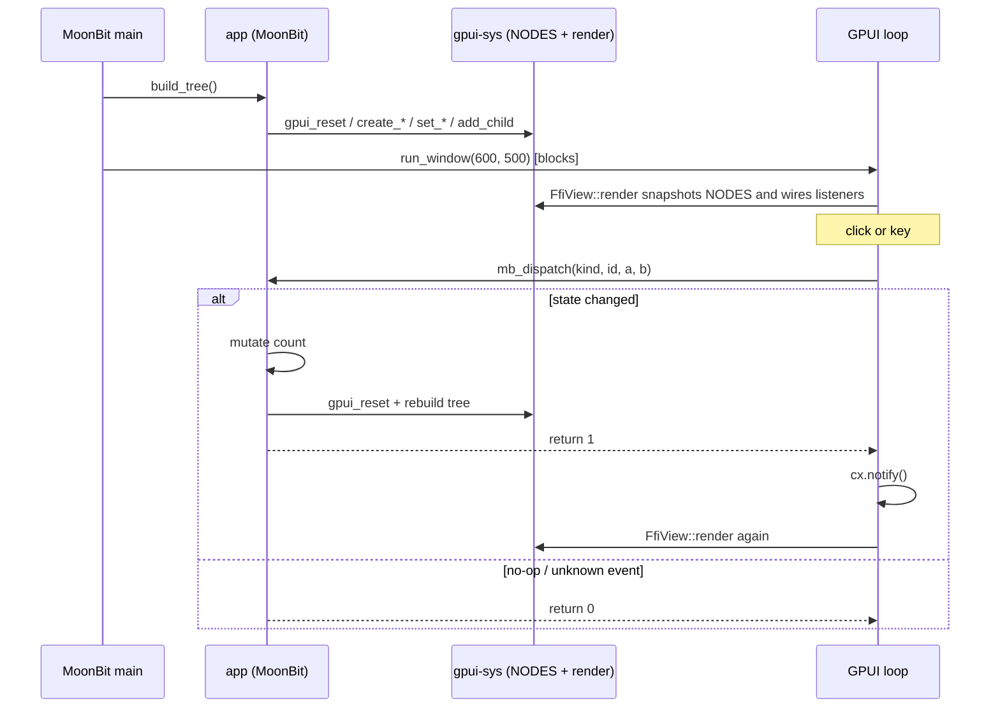

# Architecture (current)

Authoritative, AI-oriented description of how this project is wired **right now**. It is an experimental, native-only Rust/GPUI ↔ MoonBit integration, not a stable general-purpose UI API. Facts are concrete (file paths, symbols, signatures); update this file with the code.

Related docs: [`README.md`](../README.md) (build/run), [`moonbit-bindings/README.mbt.md`](../moonbit-bindings/README.mbt.md), [`moonbit-native-notes.md`](moonbit-native-notes.md) (historical low-level observations), and [`troubleshooting.md`](troubleshooting.md) (past bugs).

## 1. What it is

Call **Zed's GPUI** (Rust, GPU-accelerated UI) from **MoonBit** through a Rust/C FFI layer. The current demo is an interactive Counter: buttons `-1`, `Reset`, `+1`, and `+10`; keys `j`, `k`, and `r`. UI description and Counter logic live in MoonBit; retained-tree storage, rendering, the GPUI event loop, and the bridge live in Rust.

- **`main` is owned by MoonBit** (`moon run` / the bundled binary). Rust is a static library linked into that executable.
- The model is **retained + reactive**: MoonBit builds a node tree stored in Rust, GPUI renders it, and events call back into MoonBit. A callback that changes state rebuilds the whole tree and returns `1`; a no-op returns `0`. Rust notifies GPUI only for `1`.

## 2. Components

| Dir | Lang | Role | Key files |
|---|---|---|---|
| `gpui-sys/` | Rust | Static library exposing GPUI over the C ABI; node store, rendering, event listeners | `src/lib.rs`, `build.rs`, `abi.toml`, `cbindgen.toml` |
| `bindgen-moonbit/` | Rust | CLI parsing the generated C header into MoonBit FFI import declarations | `src/main.rs` |
| `moonbit-bindings/` | MoonBit | High-level API, Counter state/logic, and MoonBit `main` | `gpui-bindings.mbt`, generated `gpui-bindings-ffi.mbt`, `app/app.mbt`, `cmd/main/main.mbt` |
| root | shell / PowerShell | Cross-language build orchestration and platform setup | `build.sh`, `build.ps1`, `bundle.sh` |

The target is MoonBit `native`. Supported host/target pairs are macOS arm64 or x86_64, Linux x86_64 (including WSLg), and Windows MSVC x64; cross compilation is outside the supported path. Toolchain minimum versions are not pinned by this repository. Build drivers print the observed versions and Cargo.lock fixes the dependency resolution, currently including GPUI 0.2.2.

## 3. Runtime model (retained tree)

- Rust holds `static NODES: Mutex<Vec<Option<UiNode>>>` in `gpui-sys/src/lib.rs`.
  `UiNode` is either `Div { size, bg, flex/flex_col, center, gap, rounded, on_click, children }` or `Text { content, color, size }`.
- MoonBit builds nodes by handle: `create_div` and `create_text` push a node. A successful creator returns a non-negative `i32` handle; a negative return is a status/error. Setters and `add_child` mutate by handle.
- `add_child(parent, child)` moves the child node into the parent's `children`, leaving the child's slot absent.
- `FfiView::render` snapshots `NODES` by cloning the present nodes while the mutex is held, releases the mutex, and only then builds GPUI elements/listeners. This keeps the lock out of listener and callback paths.
- The outer Rust render container (not the MoonBit-created root node) is a full-size flex column that tracks `FfiView.focus` and receives `on_key_down`. Each clickable div is assigned `.id(("gpui_click", click_id))` and an `on_click` listener.
- `gpui_reset()` clears `NODES`, allowing MoonBit to rebuild from scratch after a state-changing event. No-op events skip reset and rebuilding.

## 4. FFI contract (two directions)

### 4a. MoonBit → Rust (C ABI; UI builder API)

C symbols in `gpui-sys/include/gpui_sys.h` correspond to Rust `#[unsafe(no_mangle)] pub extern "C"` functions in `gpui-sys/src/lib.rs`. The header is consumed by `bindgen-moonbit` to create `gpui-bindings-ffi.mbt`; `gpui-bindings.mbt` wraps it.

| C symbol | MoonBit wrapper (`gpui-bindings.mbt`) |
|---|---|
| `gpui_create_div() -> i32` | `create_div() -> NodeHandle` |
| `gpui_set_size/bg/flex/center/gap/rounded(...)` | `set_size`, `set_bg`, `set_flex_row`/`set_flex_col`, `set_center`, `set_gap`, `set_rounded` |
| `gpui_set_on_click(handle, click_id)` | `set_on_click(handle, click_id)` |
| `gpui_create_text(const uint8_t *ptr, int32_t len, ...) -> i32` | `create_text(String, r, g, b, size)` |
| `gpui_add_child(parent, child)` | `add_child(parent, child)` |
| `gpui_reset()` | `reset()` |
| `gpui_run_window(w, h)` | `run_window(w, h)` — blocks in the GPUI event loop |

The text ABI is explicit borrowed UTF-8 bytes:

```c
int32_t gpui_create_text(const uint8_t *ptr, int32_t len,
                         uint8_t r, uint8_t g, uint8_t b, float size);
```

The generated FFI declaration takes `Bytes` with `#borrow(ptr)`. High-level `create_text` converts MoonBit `String` with `@utf8.encode`, passes the `Bytes` and `Bytes.length()`, and never appends a NUL terminator. Rust reads the pointer/length only for the call, decoding with `String::from_utf8_lossy`.

| Return value | Meaning |
|---|---|
| `GPUI_STATUS_OK` (`0`) | Operation completed successfully |
| `GPUI_STATUS_INVALID_HANDLE` (`-1`) | Negative, out-of-range, duplicate, or unallocatable node handle |
| `GPUI_STATUS_WRONG_NODE_KIND` (`-2`) | Requested operation does not apply to the node kind |
| `GPUI_STATUS_NODE_ABSENT` (`-3`) | Node was already moved into another node by `gpui_add_child` |
| `GPUI_STATUS_INTERNAL_PANIC` (`-4`) | Rust panic was caught before crossing the C boundary |

Setters, `gpui_reset`, and `gpui_run_window` return these statuses. Current high-level MoonBit wrappers call `ignore` on those return values, so their callers cannot observe the errors. A creation call returns either its non-negative handle or a negative status.

### 4b. Rust → MoonBit (event callback)

- One callback: MoonBit `app.dispatch(kind, id, a, b) -> Int` in `moonbit-bindings/app/app.mbt`.
- Rust's generated extern calls it as `mb_dispatch(kind, id, a, b) -> i32`. `gpui-sys/build.rs` reads `gpui-sys/mb_symbol.txt` and emits the `#[link_name]` declaration.
- The payload is fixed at four `i32` values. A return value of `1` means state changed and the tree was rebuilt; `0` means unchanged. Rust calls `cx.notify()` only for `1`.
- Event kinds, modifier bits, callback parameters, and callback return type come from `gpui-sys/abi.toml`; the drivers generate constants and validate the signature.
- `cmd/main/main.mbt` binds `app.dispatch` to `_keep`, preventing dead-code elimination of a function referenced only from Rust.

The drivers extract the real current mangled spelling for fixed `app.dispatch`, so a toolchain mangling change is followed. This is not automatic package/function rename support: changing `app` or `dispatch` requires updating `PKG_FN_SUFFIX` in `build.sh`, `$PkgFnSuffix` in `build.ps1`, and the callback ABI policy/template in `gpui-sys/build.rs`. Since MoonBit's mangled spelling excludes types, the drivers separately validate an `int32_t` return and four `int32_t` parameters from generated C when `main.c` is available.

## 5. Data flow



`EVENT_CLICK=1` and `EVENT_KEY=2` come from `abi.toml`. A click listener supplies `(EVENT_CLICK, click_id, 0, 0)`. The outer focused container maps a single-character key to its Unicode codepoint and sends `(EVENT_KEY, 0, codepoint, mods_bits)`; named or multi-character keys are ignored. MoonBit decides semantics: `BTN_DECREMENT=1`, `BTN_RESET=2`, `BTN_INCREMENT=3`, `BTN_INCREMENT_10=4`; `j=106`, `k=107`, and `r=114`.

## 6. Build and run pipeline

Use a root build driver. A bare `cargo build` lacks the locally generated `gpui-sys/mb_symbol.txt`. A bare `moon build` can leave a stale executable because MoonBit does not track a changed external static archive.

`build.sh` supports macOS arm64/x86_64 and Linux x86_64; `build.ps1` supports Windows MSVC x64. Each driver runs a prerequisite/architecture preflight before changing generated files. The selected `moon.pkg.*` template receives Cargo's native static-library list as its base. Linux normalizes XCB/XKB flags to versioned SONAMEs for runtime-only and `.linux-libs` environments and adds the required `libxcb-xkb` compatibility dependency.

Both drivers perform this order:

1. Validate the native host/target and required MoonBit, Rust, compiler/linker, and symbol tools; print toolchain versions and derive the native Rust host plus actual Cargo target directory for diagnostics and linking.
2. Generate MoonBit ABI constants from `gpui-sys/abi.toml`. Run `bindgen-moonbit` against the **currently generated** `gpui-sys/include/gpui_sys.h`, then format the generated MoonBit files.
3. Run fatal `moon check`, then a cold `moon build` with no Cargo-derived native libraries yet. A native-link failure is expected at this bootstrap stage; the later build with the complete Cargo list is the strict link gate.
4. Extract exactly one `app.dispatch` mangled symbol; validate the generated C prototype as an `int32_t` return with four `int32_t` parameters where `main.c` exists. The explicit `_keep` type in `cmd/main/main.mbt` is the MoonBit compile-time signature anchor on every platform.
5. Build `gpui-sys` for the detected native Rust host, capture `cargo rustc --lib --crate-type staticlib -- --print native-static-libs`, and generate the final platform `moon.pkg` using the target directory reported by Cargo metadata. `build.rs` reads `mb_symbol.txt`, generates the callback extern, regenerates Rust ABI constants, and regenerates `include/gpui_sys.h` with cbindgen.
6. Remove MoonBit linked output and build again, forcing relink against the fresh Rust static library and Cargo-derived native dependencies.
7. Validate linkage: macOS/Linux inspect the final binary for exactly one callback definition. Windows verifies one callback definition in MoonBit's `main.obj`, one unresolved reference in `gpui_sys.lib`, and successful final linking because a linked PE normally omits its COFF symbol table.

The initial bindgen step necessarily sees the header from the prior Rust build. Therefore, after changing Rust C exports, run/review the driver again as needed so the newly regenerated header and tracked `gpui-bindings-ffi.mbt` are synchronized; do not assume the one initial bindgen invocation consumed a header regenerated later in the same driver run.

`gpui-sys` is a `staticlib`: its unresolved `mb_dispatch` reference is resolved only at the final MoonBit executable link. The platform templates carry placeholders for the detected Rust library directory and Cargo-derived native link flags; Linux applies the SONAME compatibility normalization described above. On macOS, `bundle.sh` creates `dist/Counter.app`, and that bundle is required for keyboard delivery. On Linux, use the executable directly; `.linux-libs` is an ignored local fallback for unavailable system XCB/XKB runtime libraries. In WSLg, `env -u WAYLAND_DISPLAY` is the reliable explicit X11 launch. Rust catches a Wayland startup panic and retries once with that variable removed. Windows uses the MSVC x64 setup prepared by `build.ps1`.

## 7. Invariants and gotchas

- **Text:** pass borrowed UTF-8 `Bytes` plus length, never a MoonBit `String` as a C pointer and never a NUL-terminated C-string contract.
- **Callback:** the current mangled spelling is extracted, but fixed `app.dispatch(kind, id, a, b) -> i32`, its four `i32` parameters, and `0`/`1` result policy are checked. Renaming the package/function requires both driver suffix updates.
- **Relink:** after changing `gpui-sys`, use a root driver or explicitly clean MoonBit linked output before `moon build`.
- **Locking:** render must snapshot and release `NODES` before listeners can invoke MoonBit callbacks.
- **Keyboard:** on macOS run the `.app`; focus is assigned when the GPUI view is constructed, not during `render`.
- **ABI constants:** edit `gpui-sys/abi.toml`, never generated `abi_constants.rs` or `abi_constants.mbt`.
- **Generated FFI:** do not hand-edit `gpui-bindings-ffi.mbt`; verify it against the header after Rust C-export changes.

## 8. Source and generated-file ownership

| Category | Files |
|---|---|
| Hand-edited ABI source | `gpui-sys/abi.toml` |
| Hand-edited implementation | `gpui-sys/src/lib.rs`, `moonbit-bindings/gpui-bindings.mbt`, `moonbit-bindings/app/app.mbt` |
| Tracked generated source | `gpui-sys/include/gpui_sys.h`, `gpui-sys/src/abi_constants.rs`, `moonbit-bindings/abi_constants.mbt`, `moonbit-bindings/gpui-bindings-ffi.mbt` |
| Hand-edited OS templates | `moonbit-bindings/cmd/main/moon.pkg.macos`, `.linux`, `.windows` |
| Ignored build-generated files | `moonbit-bindings/cmd/main/moon.pkg`, `gpui-sys/mb_symbol.txt`, `_build/`, `target/`, `dist/` |
| Ignored manually provisioned fallback | `.linux-libs/` |

## 9. Validation scope

`GPUI_SYS_ALLOW_TEST_DISPATCH_STUB=1 cargo test --features test-dispatch-stub` in `gpui-sys/` fixes the node-store handle, status, setter, move-on-attach, and notification-gate behavior without requiring a linked MoonBit callback. The extra environment opt-in prevents an accidental `--all-features` production build from silently replacing the real callback. From `moonbit-bindings/`, `moon check` typechecks the MoonBit module and `moon test` validates high-level bindings plus event changed/unchanged transitions. They do not validate callback extraction or final cross-language linkage; root drivers perform those integration checks. Issue #8 still retains broader automation work for a fully clean `_build`/`target` build and non-ASCII/embedded-NUL text traversing the complete MoonBit→C→Rust boundary; current tests cover MoonBit UTF-8 encoding and Rust pointer/length decoding separately. Generated FFI freshness after a Rust C-export change still requires the rerun/review described in §6 because bindgen runs before Cargo regenerates the header. There is no active root CI configuration. WSL/Linux was rechecked on 2026-07-20 with a full build, a Rust-only forced relink, and a GUI `+1` interaction. The latest Windows check is 2026-07-19; macOS was not rechecked.

## 10. File → concern map

- Node store, C-ABI exports, render, event listeners: `gpui-sys/src/lib.rs`
- Callback-symbol injection, cbindgen header generation, Rust ABI constants: `gpui-sys/build.rs`
- ABI event/modifier constants and fixed callback policy: `gpui-sys/abi.toml`
- C→MoonBit type mapping and FFI generation: `bindgen-moonbit/src/main.rs`
- Generated low-level MoonBit imports: `moonbit-bindings/gpui-bindings-ffi.mbt`
- High-level MoonBit UI API and UTF-8 encoding: `moonbit-bindings/gpui-bindings.mbt`
- Counter state, routing, and tree construction: `moonbit-bindings/app/app.mbt`
- Entry point and callback retention: `moonbit-bindings/cmd/main/main.mbt`
- OS-native link templates: `moonbit-bindings/cmd/main/moon.pkg.*`
- Build/bundle orchestration: `build.sh`, `build.ps1`, `bundle.sh`
