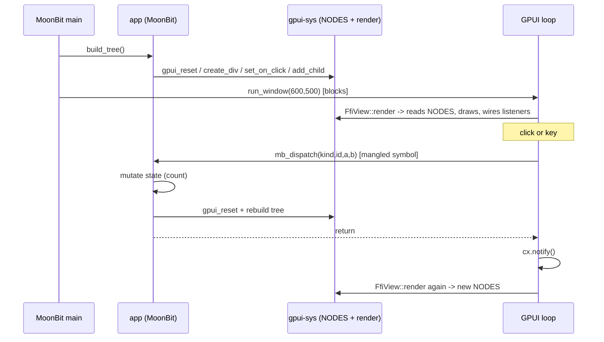

# Architecture (current)

Authoritative, AI-oriented description of how this project is wired **right now**.
Facts are concrete (file paths, symbols, signatures). If you change the code, update this file.

Related docs: [`README.md`](../README.md) (build/run), [`moonbit-native-notes.md`](./moonbit-native-notes.md)
(MoonBit native low-level gotchas), [`troubleshooting.md`](./troubleshooting.md) (past bugs), [`roadmap.md`](./roadmap.md).

## 1. What it is

Call **Zed's GPUI** (Rust, GPU-accelerated UI) from **MoonBit** through a Rust/C FFI layer.
The demo is an interactive counter (buttons + keys). UI *description* and *logic* live in MoonBit;
rendering, the event loop, and the GPUI bridge live in Rust.

- **`main` is owned by MoonBit** (`moon run` / the bundled binary). Rust is a static library linked in.
- Model is **retained + reactive**: MoonBit builds a node tree (stored in Rust), GPUI renders it,
  events call back into MoonBit, which mutates state, **rebuilds the whole tree**, and requests a re-render.

## 2. Components

| Dir | Lang | Role | Key files |
|---|---|---|---|
| `gpui-sys/` | Rust | Static lib exposing GPUI over the C ABI; owns the node store, rendering, event listeners | `src/lib.rs`, `build.rs`, `cbindgen.toml`, `include/gpui_sys.h` (generated) |
| `bindgen-moonbit/` | Rust | CLI that parses the C header → generates MoonBit FFI import decls | `src/main.rs` |
| `moonbit-bindings/` | MoonBit | High-level API + app state/logic + `main` | `gpui-bindings.mbt`, `gpui-bindings-ffi.mbt` (generated), `app/app.mbt`, `cmd/main/main.mbt` |
| (root) | — | Orchestration + docs | `build.sh`, `bundle.sh`, `docs/` |

Toolchain: `gpui v0.2.2`, `moon 0.1.20260713`, target `native` (macOS/arm64, Mach-O).

## 3. Runtime model (retained tree)

- Rust holds the tree: `static NODES: Mutex<Vec<Option<UiNode>>>` in `gpui-sys/src/lib.rs`.
  `UiNode` = `Div { size, bg, flex/flex_col, center, gap, rounded, on_click: Option<i32>, children }`
  or `Text { content, color, size }`.
- MoonBit builds nodes by handle (`i32` index into `NODES`): `create_div`/`create_text` push and return the index;
  `set_*`/`add_child` mutate by index. `add_child` **moves** the child node into the parent's `children`.
- The GPUI view is `FfiView { focus: FocusHandle }`. Its `Render::render` walks `NODES` via `render_node`
  and builds GPUI elements (`div()` / text). Clickable divs get `.id(("gpui_click", cid)).on_click(...)`;
  the **Rust render container** (the outermost `div().size_full()...` built by `FfiView::render`, not the
  MoonBit-created root node) gets `.track_focus(&focus).on_key_down(...)`.
- `gpui_reset()` clears `NODES` so MoonBit can rebuild from scratch (done on every event before re-render).

## 4. FFI contract (two directions)

### 4a. MoonBit → Rust  (C ABI; the UI builder API)

C symbols (`gpui-sys/include/gpui_sys.h`) ← Rust `#[unsafe(no_mangle)] pub extern "C"` in `src/lib.rs`.
MoonBit imports them in `gpui-bindings-ffi.mbt` (auto-generated by `bindgen-moonbit`) and wraps them in
`gpui-bindings.mbt`:

| C symbol | MoonBit wrapper (`gpui-bindings.mbt`) |
|---|---|
| `gpui_create_div() -> i32` | `create_div() -> NodeHandle` |
| `gpui_set_size/bg/flex/center/gap/rounded(...)` | `set_size` / `set_bg` / `set_flex_row`+`set_flex_col` / `set_center` / `set_gap` / `set_rounded` |
| `gpui_set_on_click(handle, click_id)` | `set_on_click(handle, click_id)` |
| `gpui_create_text(const char*, r,g,b, size) -> i32` | `create_text(String, r,g,b, size)` |
| `gpui_add_child(parent, child)` | `add_child(parent, child)` |
| `gpui_reset()` | `reset()` |
| `gpui_run_window(w, h)` | `run_window(w, h)` — **blocks** in the GPUI event loop |

- Type map (in `bindgen-moonbit/src/main.rs`): `int32_t`/`uint8_t`→`Int`, `float`→`Float`, `void`→`Unit`,
  `const char *`→**`Bytes`** (not `String`).
- **Strings**: MoonBit `String` is UTF-16/non-NUL and must NOT be passed as `const char*`.
  `create_text` converts via `to_cstring_bytes` (`@utf8.encode` + NUL) → passes `Bytes`. See notes §1.

### 4b. Rust → MoonBit  (the event callback)

- One symbol: MoonBit `app.dispatch(kind, id, a, b)` (`moonbit-bindings/app/app.mbt`).
- Rust declares it as `extern "C" { fn mb_dispatch(kind, id, a, b) }` — **generated by `gpui-sys/build.rs`**
  from `gpui-sys/mb_symbol.txt` (the real mangled symbol, extracted at build time). `#[link_name]` uses it.
  See notes §3/§4 for why `#export_name` isn't used and why main isn't inverted to Rust.
- Payload is scalar `(kind, id, a, b)`; MoonBit decodes into an `Event` and routes. Adding event types does
  **not** grow the FFI (still one symbol).

## 5. Data flow

Textual: `cmd/main/main.mbt` retains `app.dispatch`, calls `app.build_tree()`, then `run_window`.
On an event, the Rust listener (in `render_node`) calls `mb_dispatch(...)`; `app.dispatch` mutates `count`,
calls `build_tree()` (which `reset`s + rebuilds `NODES`), returns; the listener calls `cx.notify()`;
GPUI re-invokes `render` which reads the fresh `NODES`.

## 6. Event model

- **Kinds**: `EVENT_CLICK=1`, `EVENT_KEY=2` come from `gpui-sys/abi.toml`; the build generates
  constants for both Rust and MoonBit, so the two sides share one source of truth.
- **Click**: `set_on_click(div, click_id)` stores `click_id` on the Div node. `render_node` attaches
  `.on_click(|_,_,_,cx| { mb_dispatch(EVENT_CLICK, click_id, 0, 0); cx.notify() })`.
  `app.on_click(click_id)` routes: `BTN_DECREMENT=1`/`BTN_RESET=2`/`BTN_INCREMENT=3`/`BTN_INCREMENT_10=4`.
- **Key**: root has `track_focus` + `on_key_down`; focused at view construction (see §8). Rust maps a
  single-character key to its codepoint and sends `mb_dispatch(EVENT_KEY, 0, codepoint, mods_bits)`
  (`key_code` / `mods_bits` helpers). `app.on_key(code, _mods)` routes `KEY_K=107`/`KEY_J=106`/`KEY_R=114`.
  Rust does translation only; MoonBit decides meaning.

## 7. Build & run pipeline

`build.sh` (root) — the correct way to build:
0. Regenerate Rust/MoonBit ABI constants from `gpui-sys/abi.toml` and regenerate the C FFI bindings.
1. `moon check` is a fatal compile/typecheck gate; then `moon build` produces `app.dispatch`'s symbol. Only an
   expected cold native-link failure (missing callback or `gpui_sys`) is tolerated; all other failures stop.
2. Extract exactly one real `app.dispatch` mangled symbol → `gpui-sys/mb_symbol.txt`. When generated `main.c`
   is available, also assert MoonBit emitted exactly four `int32_t` callback parameters (types are not mangled).
3. `cargo build` gpui-sys — `build.rs` reads `mb_symbol.txt`, generates the `mb_dispatch` `extern`, runs cbindgen.
4. Remove `main.exe` + linked-core `.o`, then `moon build` for a **forced relink** (moon does not track changes
   to the external archive). Unix verifies one callback definition in the final binary. Windows, whose linked PE
   normally omits the COFF symbol table, verifies one definition in `main.obj`, one unresolved reference in
   `gpui_sys.lib`, and a successful final link.

`bundle.sh` — wrap the binary in `dist/Counter.app` (minimal `Info.plist`). **Keyboard input requires this**;
a bare terminal binary gets mouse but not keyboard. Run: `open dist/Counter.app` or the inner binary directly.

Framework list: `cmd/main/moon.pkg` `cc-link-flags` carries gpui's transitive native libs (from
`cargo rustc --lib --crate-type staticlib -- --print native-static-libs`); regenerate when gpui changes.

## 8. Invariants & gotchas (do not break)

- **String → C**: always UTF-8 + NUL `Bytes` (never `String` as `const char*`). notes §1.
- **Callback symbol**: `build.sh` extracts `app.dispatch`'s *current* mangled symbol at build time, so a
  toolchain mangling change that keeps the same package/function is picked up automatically. **But** the
  extraction grep hard-codes the package+function suffix (`PKG_FN_SUFFIX="3app8dispatch"` in `build.sh`), so
  **renaming `dispatch` or the `app` package requires updating `PKG_FN_SUFFIX`** (otherwise `build.sh` fails
  loudly at extraction — a good failure, but not automatic). Types aren't mangled, so the build separately checks
  the generated C prototype against the four-`int32_t` Rust template. notes §3.
- **Relink**: after any gpui-sys change, use `build.sh` (or `moon clean && moon build`); a bare `moon build`
  keeps a stale exe. notes §7.
- **DCE**: `app.dispatch` is only called from Rust, so `cmd/main/main.mbt` binds it (`let _keep = ...dispatch`)
  to keep MoonBit from stripping it. notes §5.
- **Keyboard**: (a) run as a `.app` bundle; (b) focus the view **at construction** (in the `open_window`
  closure), not in `render`.
- **ABI constants**: edit `gpui-sys/abi.toml` only; never hand-edit generated `abi_constants.rs`/`.mbt`.
- **Rebuild strategy**: every `dispatch` does full `gpui_reset()` + rebuild (no diffing). Don't hold the
  `NODES` lock across `mb_dispatch`.
- **`gpui-sys` crate-type is `["staticlib"]`** (not cdylib): the `.a` references `mb_dispatch` as an undefined
  external resolved at the final link; a cdylib would fail to build. notes §7.

## 9. How to extend

- **New style/element**: add a field/variant to `UiNode` + a `gpui_*` setter in `lib.rs`, apply it in
  `render_node`; `cargo build` regenerates the header; regenerate FFI (`bindgen-moonbit`); add a wrapper in
  `gpui-bindings.mbt`. (Adds a C symbol — that's fine; only the *callback* direction is the fragile one.)
- **New button/action**: MoonBit only — add a `BTN_*` const, a branch in `on_click`, a `make_button(...)`
  in `build_tree`. No Rust change.
- **New event kind** (e.g. hover, mouse move): add `EVENT_X` under `[events]` in `gpui-sys/abi.toml`, wire the
  GPUI handler in `render_node`/`FfiView` to call `mb_dispatch(EVENT_X, ...)`, add an `Event` variant + `decode`
  branch + handler in `app.mbt`. **No new FFI symbol** (payload is reused).

## 10. File → concern map

- Node store, C-ABI exports, render, event listeners, Rust→MoonBit `extern`: `gpui-sys/src/lib.rs`
- Callback-symbol injection + cbindgen: `gpui-sys/build.rs` (+ `mb_symbol.txt`, generated)
- C→MoonBit type mapping / FFI generation: `bindgen-moonbit/src/main.rs`
- MoonBit low-level FFI imports (generated): `moonbit-bindings/gpui-bindings-ffi.mbt`
- MoonBit high-level UI API: `moonbit-bindings/gpui-bindings.mbt`
- App state, event routing, UI construction: `moonbit-bindings/app/app.mbt`
- Entry (retain dispatch, build, run): `moonbit-bindings/cmd/main/main.mbt`
- Native link flags (frameworks): `moonbit-bindings/cmd/main/moon.pkg`
- Build/bundle orchestration: `build.sh`, `bundle.sh`
