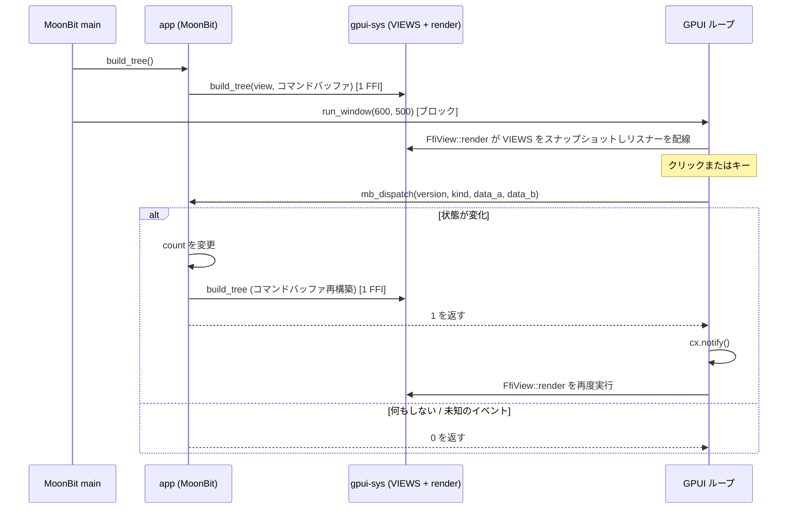

# アーキテクチャ（現状）

本プロジェクトが**現時点で**どのように組み上がっているかを、AI 向けに権威的に記述したドキュメント。これは実験的な、ネイティブ専用の Rust/GPUI ↔ MoonBit 統合であり、安定した汎用 UI API ではない。事実は具体的（ファイルパス、シンボル、シグネチャ）に記す。コードに合わせてこのファイルも更新すること。

関連ドキュメント: [`README.md`](../README.md)（ビルド・実行）、[`moonbit-bindings/README.mbt.md`](../moonbit-bindings/README.mbt.md)、[`moonbit-native-notes.md`](moonbit-native-notes.md)（低レイヤの過去の観測記録）、[`troubleshooting.md`](troubleshooting.md)（過去のバグ）。

## 1. これは何か

**Zed の GPUI**（Rust 製、GPU アクセラレーション UI）を、Rust/C の FFI 層を介して **MoonBit** から呼び出す。現在のデモはインタラクティブな Counter で、ボタン `-1`・`Reset`・`+1`・`+10`、キー `j`・`k`・`r` を備える。UI の記述と Counter のロジックは MoonBit 側に、リテイン方式のツリー保存・レンダリング・GPUI イベントループ・ブリッジは Rust 側にある。

- **`main` は MoonBit が所有する**（`moon run` / バンドルされたバイナリ）。Rust はその実行ファイルにリンクされる静的ライブラリである。
- モデルは **retained + reactive** である。MoonBit がノードツリーを構築して Rust に保存し、GPUI がそれをレンダリングし、イベントは MoonBit へコールバックする。状態を変更するコールバックはツリー全体を再構築して `1` を返す。何もしないコールバックは `0` を返す。Rust は `1` のときだけ GPUI に通知する。

## 2. 構成要素

| ディレクトリ | 言語 | 役割 | 主要ファイル |
|---|---|---|---|
| `gpui-sys/` | Rust | C ABI 越しに GPUI を公開する静的ライブラリ。ノードストア、レンダリング、イベントリスナー | `src/lib.rs`、`build.rs`、`abi.toml`、`cbindgen.toml` |
| `bindgen-moonbit/` | Rust | 生成された C ヘッダーをパースして MoonBit の FFI import 宣言にする CLI | `src/main.rs` |
| `moonbit-bindings/` | MoonBit | 高レベル API、Counter の状態・ロジック、MoonBit 製 `main` | `gpui-bindings.mbt`、生成物 `gpui-bindings-ffi.mbt`、`app/app.mbt`、`cmd/main/main.mbt` |
| ルート | shell / PowerShell | 言語横断のビルド orchestration とプラットフォームセットアップ | `build.sh`、`build.ps1`、`bundle.sh` |

ターゲットは MoonBit の `native`。サポートするホスト/ターゲットの組み合わせは macOS arm64 または x86_64、Linux x86_64（WSLg を含む）、Windows MSVC x64。クロスコンパイルはサポート対象外である。ツールチェーンの最低バージョンはこのリポジトリでは固定していない。ビルドドライバは観測したバージョンを表示し、Cargo.lock が依存解決を固定する（現在は GPUI 0.2.2 を含む）。

## 3. 実行時モデル（retained tree）

- Rust は `gpui-sys/src/lib.rs` に 1 つの静的ストアを保持する。
  - `static VIEWS: Mutex<Vec<Option<UiNode>>>` — view id ごとのコミット済みツリー。`render` は自分の view のスロットを読む。
  `UiNode` は `Div { size, bg, flex/flex_col, center, gap, rounded, on_click, key, children }` または `Text { content, color, size }` のいずれかである。
- ツリー構築は **コマンドバッファ**（issue #5）である。MoonBit は `CommandBuffer` に全ノードの記述を 1 つの length-delimited な opcode ストリームとして蓄積し、`build_tree(view, cb)` 1 回の FFI 呼び出しで送信する。Rust はこれをパースしてステージングツリーを組み、ルートとキー重複を検証し、成功時のみ `VIEWS[view]` へ差し替える。失敗時はステージング状態を破棄し、以前のコミット済みツリーは無傷である。
- コマンドバッファはスタックマシンである。ノード生成（`div`/`text`）がハンドルを内部スタックへ push し、セッターはスタックトップに適用され、`add_child` は child・parent の順に pop して parent を再 push し、`set_root` はトップを pop してルートにする。
- `FfiView::render` は、mutex を保持したまま自分の view のコミット済みルートをクローンして `VIEWS` をスナップショットし、mutex を解放してから GPUI の要素/リスナーを構築する。これによりロックをリスナーとコールバックの経路から外す。コミット済みツリーがなければ空で描画する。
- 外側の Rust レンダリングコンテナ（MoonBit が生成したルートノードではない）は全サイズの flex column で、`FfiView.focus` を追跡し `on_key_down` を受け取る。各 div は安定キーがあればそれを GPUI `ElementId`（`"gpui_key:{key}"`）として使い、なければクリック可能 div に限り click_id から ID（`"gpui_click"`）を合成する。クリック可能な div には `on_click` リスナーが割り当てられる。
- 状態変更イベントの後、MoonBit は新しいコマンドバッファでツリーをゼロから再構築して `build_tree` する。何もしないイベントは再構築も commit もスキップする。
- **安定ノード識別（issue #9）**: `set_key(key)` は div に明示的な安定キーを設定する。設定されたキーは GPUI の `ElementId`（`"gpui_key:{key}"`）になり、クリック有無に関わらず再構築を跨いで stateful element の同一性を保つ。キー未設定のクリック可能 div は従来どおり click_id から ID を合成する（`"gpui_click"`）。click_id はアクションルーティング専用であり、キーとは独立（click_id の重複は許容、キーの重複は `build_tree` が拒否）。

## 4. FFI 契約（双方向）

### 4a. MoonBit → Rust（C ABI、UI ビルダー API）

`gpui-sys/include/gpui_sys.h` の C シンボルは、`gpui-sys/src/lib.rs` の Rust 側 `#[unsafe(no_mangle)] pub extern "C"` 関数に対応する。このヘッダーを `bindgen-moonbit` が消費して `gpui-bindings-ffi.mbt` を生成し、`gpui-bindings.mbt` がそれをラップする。UI 構築の FFI は **2 つだけ**である（issue #5 で property-per-call から集約）:

| C シンボル | MoonBit ラッパー（`gpui-bindings.mbt`） |
|---|---|
| `gpui_build_tree(view, const uint8_t *ptr, int32_t len) -> i32` | `build_tree(view, cb)` — コマンドバッファ 1 回でツリーを構築・コミット |
| `gpui_run_window(w, h)` | `run_window(w, h)` — GPUI イベントループ内でブロックする |

コマンドバッファのワイヤ形式（すべてリトルエンディアン）:

```
ヘッダ:  "GPUI" (4 bytes) | BUFFER_VERSION (u32)
OP_DIV            u8
OP_TEXT           u8 | len u32 | utf8[len] | r u8 | g u8 | b u8 | size f32
OP_SET_SIZE       u8 | w f32 | h f32
OP_SET_BG         u8 | r u8 | g u8 | b u8
OP_SET_FLEX       u8 | col u8
OP_SET_CENTER     u8
OP_SET_GAP        u8 | gap f32
OP_SET_ROUNDED    u8 | radius f32
OP_SET_ON_CLICK   u8 | click_id i32
OP_SET_KEY        u8 | len u32 | utf8[len]
OP_ADD_CHILD      u8            (child, parent の順に pop; parent を再 push)
OP_SET_ROOT       u8            (トップを pop してルートに)
```

opcode と `BUFFER_VERSION` は `gpui-sys/abi.toml` の `[opcodes]`/`[buffer]` セクションから両言語へ生成される（Rust は `build.rs`、MoonBit は `build.sh` の awk）。境界横断の定数一致テスト（drift guard）がエンコーダとデコーダの食い違いをコンパイル時ではなく実行時前に検出する。MoonBit の `CommandBuffer` は `@buffer.Buffer` でバイト列を組み、`@utf8.encode` で文字列を UTF-8 化する。Rust はポインタ/長さをその呼び出しの間だけ読み取り、文字列は `String::from_utf8_lossy` でデコードする。

| 戻り値 | 意味 |
|---|---|
| `GPUI_STATUS_OK`（`0`） | 操作が正常に完了した |
| `GPUI_STATUS_INVALID_HANDLE`（`-1`） | ハンドル/スタックが負、範囲外、空、または割り当て不能 |
| `GPUI_STATUS_WRONG_NODE_KIND`（`-2`） | 要求した操作がそのノード種別には適用できない |
| `GPUI_STATUS_NODE_ABSENT`（`-3`） | ノードは既に `OP_ADD_CHILD` で別のノードへ移動済み |
| `GPUI_STATUS_INTERNAL_PANIC`（`-4`） | C 境界を越える前に Rust の panic を捕捉した |
| `GPUI_STATUS_BAD_BUFFER_VERSION`（`-5`） | コマンドバッファの magic またはバージョンが不一致 |
| `GPUI_STATUS_TRUNCATED_BUFFER`（`-6`） | バッファがフィールド途中で終了、またはペイロードが切り詰め/過大 |
| `GPUI_STATUS_UNKNOWN_OPCODE`（`-7`） | このビルドが認識しない opcode |
| `GPUI_STATUS_NO_ROOT`（`-8`） | `OP_SET_ROOT` なしでバッファが終了した |
| `GPUI_STATUS_DUPLICATE_KEY`（`-9`） | コミットするツリー内で 2 つ以上のノードが同じキーを持つ |

`gpui_build_tree` と `gpui_run_window` はこれらのステータスを返す。高レベル MoonBit ラッパー `build_tree` と `run_window` は `Result[Unit, Int]` を返し、`Err(status)` で負の status code を呼び出し元に伝播する。`dispatch` 内の再構築失敗時はログ出力して `changed` をそのまま返す（Rust 側は旧ツリーを保持済みのため、`cx.notify()` で旧ツリーが再描画される）。

### 4b. Rust → MoonBit（イベントコールバック）

- コールバックは 1つ: MoonBit の `app.dispatch(version, kind, data_a, data_b) -> Int`（`moonbit-bindings/app/app.mbt` 内）。
- Rust 側の生成された extern はこれを `mb_dispatch(version, kind, data_a, data_b) -> i32` として呼ぶ。`gpui-sys/build.rs` は `gpui-sys/mb_symbol.txt` を読み取り、`#[link_name]` 宣言を出力する。
- 4 スロットは**バージョニング済みイベントエンベロープ** `(abi_version, event_kind, data_a, data_b)` を運ぶ。slot 0 は常に `ABI_VERSION` で、MoonBit 側は不一致時に `Unknown` を返して古い Rust バイナリをランタイムに拒否する。戻り値 `1` は状態変化（ツリー再構築）、`0` は不変。Rust は `1` のときだけ `cx.notify()` を呼ぶ。
- イベント種別・エンベロープ定数・コールバックのパラメータと戻り値型は `gpui-sys/abi.toml` に由来する。ドライバが定数を生成し、シグネチャを検証する。
- `EVENT_TEXT` のペイロードは Rust 所有のイベントキューに格納され、`gpui_event_copy_text(token, buf, len)` C export 経由で MoonBit が同期的にコピーする。64 ビットポインタは i32 スロットに収まらないため、トークン＋コピー方式を採用する。
- `EVENT_NAMED_KEY` は Enter/Escape/矢印などの名前付きキーを ABI id（`abi.toml` の `[named_keys]`）で運ぶ。1 文字キーは `key_code` がコードポイントへ変換し `EVENT_KEY` になるのに対し、`key_code` が 0 を返す名前付きキーを `named_key_id` が id へマップして `(3, EVENT_NAMED_KEY, named_key_id, mods_bits)` を送る。新しいイベント種別の追加は後方互換（古い MoonBit は未知 kind を `Unknown` として 0 を返す）なので `ABI_VERSION` は据え置き。
- `cmd/main/main.mbt` は `app.dispatch` を `_keep` に束縛し、Rust からのみ参照される関数の dead-code elimination（不要コード削除）を防ぐ。

ドライバは固定の `app.dispatch` に対する実際の現在のマングル名を抽出するため、ツールチェーンのマングル方式の変更にも追従する。これはパッケージ/関数名の自動リネームサポートではない。`app` や `dispatch` を変更する場合は、`build.sh` の `PKG_FN_SUFFIX`、`build.ps1` の `$PkgFnSuffix`、および `gpui-sys/build.rs` のコールバック ABI ポリシー/テンプレートを更新する必要がある。MoonBit のマングル名には型が含まれないため、ドライバは `main.c` が利用可能な場合、生成された C から `int32_t` の戻り値と 4 つの `int32_t` パラメータを別途検証する。

## 5. データフロー



`EVENT_CLICK=1`、`EVENT_KEY=2`、`EVENT_TEXT=3`、`EVENT_NAMED_KEY=4` は `abi.toml` に由来する（`ABI_VERSION=3`）。クリックリスナーは `(3, EVENT_CLICK, click_id, 0)` を供給する。外側のフォーカスされたコンテナは 1 文字のキーをその Unicode コードポイントへマップし `(3, EVENT_KEY, codepoint, mods_bits)` を送る。`EVENT_TEXT` は `(3, EVENT_TEXT, token, byte_len)` を送り、MoonBit は `gpui_event_copy_text` で UTF-8 ペイロードをコピーする。`key_char`（IME/レイアウト処理後の実際の入力文字）を使用するため、複数文字や合成文字も正しく届く。名前付きキー（Enter/Escape/矢印/Tab/Backspace/Delete/Home/End/PageUp/PageDown）は `key_code` が 0 を返すため、`named_key_id` が `[named_keys]` の id へマップし `(3, EVENT_NAMED_KEY, named_key_id, mods_bits)` を送る。Enter は `key_char` が `"\n"` のため `EVENT_TEXT` も同時に発火するが、デモの `on_text` は非数字を無視するため二重カウントにはならない。意味の決定は MoonBit が行う: `BTN_DECREMENT=1`、`BTN_RESET=2`、`BTN_INCREMENT=3`、`BTN_INCREMENT_10=4`、`j=106`、`k=107`、`r=114`、`KEY_ENTER`/`KEY_UP`→+1、`KEY_DOWN`→-1、`KEY_ESCAPE`→reset。

## 6. ビルドと実行のパイプライン

ルートのビルドドライバを使用すること。素の `cargo build` にはローカルで生成される `gpui-sys/mb_symbol.txt` が欠ける。素の `moon build` は、MoonBit が変更された外部静的アーカイブを追跡しないため、古い実行ファイルを残すことがある。

`build.sh` は macOS arm64/x86_64 と Linux x86_64 をサポートし、`build.ps1` は Windows MSVC x64 をサポートする。各ドライバは、生成ファイルを変更する前に前提条件/アーキテクチャの事前チェック（preflight）を実行する。選択された `moon.pkg.*` テンプレートは、Cargo のネイティブ静的ライブラリ一覧をそのベースとして受け取る。Linux は XCB/XKB のフラグを、ランタイム専用環境および `.linux-libs` 環境向けにバージョン付き SONAME へ正規化し、必要な `libxcb-xkb` 互換依存を追加する。

両ドライバとも次の順序で処理する:

1. ネイティブのホスト/ターゲットと、必要な MoonBit、Rust、コンパイラ/リンカ、シンボルツールを検証する。ツールチェーンのバージョンを表示し、診断とリンクのためにネイティブの Rust ホストと実際の Cargo ターゲットディレクトリを導出する。
2. `gpui-sys/abi.toml` から MoonBit の ABI 定数を生成する。**現在生成されている** `gpui-sys/include/gpui_sys.h` に対して `bindgen-moonbit` を実行し、生成された MoonBit ファイルをフォーマットする。
3. fatal な `moon check` を実行し、その後 Cargo 由来のネイティブライブラリをまだ持たない状態でコールドな `moon build` を行う。このブートストラップ段階ではネイティブリンクの失敗が想定される。完全な Cargo 一覧を用いる後のビルドが厳密なリンクのゲートである。
4. `app.dispatch` のマングルされたシンボルをちょうど 1 つ抽出する。`main.c` が存在する場所では、生成された C のプロトタイプを `int32_t` の戻り値と 4 つの `int32_t` パラメータとして検証する。`cmd/main/main.mbt` の明示的な `_keep` 型が、全プラットフォームにおける MoonBit コンパイル時のシグネチャアンカーである。
5. 検出されたネイティブの Rust ホスト向けに `gpui-sys` をビルドし、`cargo rustc --lib --crate-type staticlib -- --print native-static-libs` を捕捉し、Cargo metadata が報告するターゲットディレクトリを使って最終的なプラットフォーム用 `moon.pkg` を生成する。`build.rs` は `mb_symbol.txt` を読み取り、コールバックの extern を生成し、Rust の ABI 定数を再生成し、cbindgen で `include/gpui_sys.h` を再生成する。
6. MoonBit のリンク済み出力を削除して再度ビルドし、新しい Rust 静的ライブラリと Cargo 由来のネイティブ依存に対して強制的に再リンクする。
7. リンケージを検証する。macOS/Linux は最終バイナリを調べ、コールバック定義がちょうど 1 つであることを確認する。Windows は、MoonBit の `main.obj` にコールバック定義が 1 つ、`gpui_sys.lib` に未解決参照が 1 つあること、および最終リンクが成功することを検証する（リンク済み PE は通常 COFF シンボルテーブルを省略するため）。
8. ヘッドレス往復テスト（`cmd/roundtrip`）を実行する。MoonBit がエッジケースのテキスト（NUL バイト・多バイト UTF-8・4 バイト絵文字）を含むツリーを `gpui_build_tree` で送信し、`gpui_debug_dump_text` で読み戻してバイト単位で比較する。GUI なしで MoonBit→C→Rust→C→MoonBit の完全な FFI 往復を検証する（issue #34）。

最初の bindgen ステップは、必然的に 1 つ前の Rust ビルド由来のヘッダーを参照する。したがって、Rust の C エクスポートを変更した後は、必要に応じてドライバを再実行/再確認し、新たに再生成されたヘッダーと追跡対象の `gpui-bindings-ffi.mbt` を同期させること。最初の 1 回の bindgen 呼び出しが、同じドライバ実行内で後から再生成されるヘッダーを消費したと仮定してはならない。

`gpui-sys` は `staticlib` である。その未解決の `mb_dispatch` 参照は、最終的な MoonBit 実行ファイルのリンク時にのみ解決される。プラットフォームのテンプレートには、検出された Rust ライブラリディレクトリと Cargo 由来のネイティブリンクフラグ用のプレースホルダが含まれる。Linux は上述の SONAME 互換正規化を適用する。macOS では `bundle.sh` が `dist/Counter.app` を作成し、キーボードの配送にはこのバンドルが必要である。Linux では実行ファイルを直接使う。`.linux-libs` は、利用できないシステムの XCB/XKB ランタイムライブラリ用の、無視されるローカルフォールバックである。WSLg では `env -u WAYLAND_DISPLAY` が確実な明示的 X11 起動方法である。Rust は Wayland 起動時の panic を捕捉し、その変数を除去して 1 度だけ再試行する。Windows は `build.ps1` が用意する MSVC x64 セットアップを使う。

## 7. 不変条件と落とし穴

- **テキスト:** 借用した UTF-8 の `Bytes` と長さを渡す。MoonBit の `String` を C ポインタとして渡したり、NUL 終端の C 文字列契約を用いたりしてはならない。
- **コールバック:** 現在のマングル名は抽出されるが、固定の `app.dispatch(version, kind, data_a, data_b) -> i32`、その 4 つの `i32` パラメータ（slot 0 = ABI_VERSION）、および `0`/`1` の結果ポリシーはチェックされる。パッケージ/関数名のリネームには、両ドライバの suffix 更新が必要である。
- **再リンク:** `gpui-sys` を変更した後は、ルートのドライバを使うか、`moon build` の前に MoonBit のリンク済み出力を明示的にクリーンすること。
- **ロック:** render は、リスナーが MoonBit コールバックを呼び出し得る前に、`VIEWS` をスナップショットして解放しなければならない。
- **キーボード:** macOS では `.app` を実行すること。フォーカスは `render` 中ではなく、GPUI ビュー構築時に割り当てられる。
- **ABI 定数:** `gpui-sys/abi.toml` を編集すること。生成物の `abi_constants.rs` や `abi_constants.mbt` を直接編集してはならない。
- **生成された FFI:** `gpui-bindings-ffi.mbt` を手編集しないこと。Rust の C エクスポート変更後は、ヘッダーと突き合わせて検証すること。

## 8. ソースと生成ファイルの所有区分

| 区分 | ファイル |
|---|---|
| 手編集の ABI ソース | `gpui-sys/abi.toml` |
| 手編集の実装 | `gpui-sys/src/lib.rs`、`moonbit-bindings/gpui-bindings.mbt`、`moonbit-bindings/app/app.mbt` |
| 追跡対象の生成ソース | `gpui-sys/include/gpui_sys.h`、`gpui-sys/src/abi_constants.rs`、`moonbit-bindings/abi_constants.mbt`、`moonbit-bindings/gpui-bindings-ffi.mbt` |
| 手編集の OS テンプレート | `moonbit-bindings/cmd/main/moon.pkg.macos`、`.linux`、`.windows`、`moonbit-bindings/cmd/roundtrip/moon.pkg.*` |
| 無視されるビルド生成物 | `moonbit-bindings/cmd/main/moon.pkg`、`moonbit-bindings/cmd/roundtrip/moon.pkg`、`gpui-sys/mb_symbol.txt`、`_build/`、`target/`、`dist/` |
| 無視される手動配置フォールバック | `.linux-libs/` |

## 9. 検証の範囲

`gpui-sys/` での `GPUI_SYS_ALLOW_TEST_DISPATCH_STUB=1 cargo test --features test-dispatch-stub` は、リンクされた MoonBit コールバックを必要とせずに、コマンドバッファのパース（magic/バージョン・opcode・切り詰め・未知 opcode）、スタック/ハンドル検証（空スタック・テキストトップ・add_child のポップ順序・set_root）、コミット検証（ルート必須・キー重複拒否・click_id 重複許容・view ごとの差し替え）、move/forest セマンティクス（attach はコピーでなく move・サブツリーは内容ごと移動・未 attach ノードはコミットから脱落・最後の `set_root` が勝つ）、敵対的な文字列長（`u32::MAX` 近傍でもカーソルオーバーフローせず `TRUNCATED_BUFFER`）・lossy UTF-8（不正バイト列は U+FFFD 置換で致命的にしない）、通知ゲート、および `abi.toml` と生成済み Rust/MoonBit 定数（opcode と BUFFER_VERSION を含む）の境界横断一致（drift guard）を固定する。追加の環境変数によるオプトインは、誤った `--all-features` での本番ビルドが実際のコールバックを暗黙に置き換えることを防ぐ。`moonbit-bindings/` からは、`moon check` が MoonBit モジュールを型チェックし、`moon test` が高レベルバインディング（色クランプ・埋め込み NUL を含む UTF-8 エンコード）、Rust デコーダのレイアウトに対するコマンドバッファのバイト正確なワイヤ形式（ヘッダ・OP_TEXT オペランド・リトルエンディアン f32）、およびイベントの変化/不変化の遷移を検証する。これらはコールバック抽出や最終的な言語横断リンケージは検証しない。それらの統合チェックはルートのドライバが実行する。Issue #8 のチェックリスト（ハンドル操作・move-on-attach・重複/親違い attach・EVENT_*/EV_* 互換・nm シンボル・非 ASCII/埋め込み NUL・クリーンビルド・Rust 専用リビルド）はヘッドレステストと手動ドライバ実行で覆われた。GitHub Actions CI（`.github/workflows/ci.yml`）が Linux・macOS・Windows の 3 プラットフォームでクリーン `_build`/`target` からのコールドビルド、Rust/MoonBit テスト、Rust 専用変更後リビルドを自動検証する（2026-07-22 に全プラットフォーム緑確認済み）。リンク済みバイナリを通過する完全な MoonBit→C→Rust テキスト往復は、build driver の最終ステップとして実行されるヘッドレス往復テスト（`cmd/roundtrip`、issue #34）がカバーする。NUL バイト・多バイト UTF-8（ひらがな）・4 バイト絵文字を含むエッジケーステキストを `gpui_build_tree` で送信し、`gpui_debug_dump_text` で読み戻してバイト単位で比較する。Rust の C エクスポート変更後の生成 FFI の鮮度は、bindgen が Cargo によるヘッダー再生成より前に実行されるため、§6 で述べた再実行/再確認が依然として必要である。

## 10. ファイル → 関心事マップ

- ノードストア、C ABI エクスポート、レンダリング、イベントリスナー: `gpui-sys/src/lib.rs`
- コールバックシンボルの注入、cbindgen によるヘッダー生成、Rust の ABI 定数: `gpui-sys/build.rs`
- ABI のイベント/修飾定数と固定のコールバックポリシー: `gpui-sys/abi.toml`
- C→MoonBit の型マッピングと FFI 生成: `bindgen-moonbit/src/main.rs`
- 生成された低レベルの MoonBit import: `moonbit-bindings/gpui-bindings-ffi.mbt`
- 高レベルの MoonBit UI API と UTF-8 エンコード: `moonbit-bindings/gpui-bindings.mbt`
- Counter の状態、ルーティング、ツリー構築: `moonbit-bindings/app/app.mbt`
- エントリポイントとコールバックの保持: `moonbit-bindings/cmd/main/main.mbt`
- OS ネイティブのリンクテンプレート: `moonbit-bindings/cmd/main/moon.pkg.*`
- ビルド/バンドルの orchestration: `build.sh`、`build.ps1`、`bundle.sh`
- ヘッドレス往復テスト（issue #34）: `moonbit-bindings/cmd/roundtrip/main.mbt`
- デバッグ用テキスト読み戻し export: `gpui-sys/src/lib.rs`（`gpui_debug_dump_text`）
