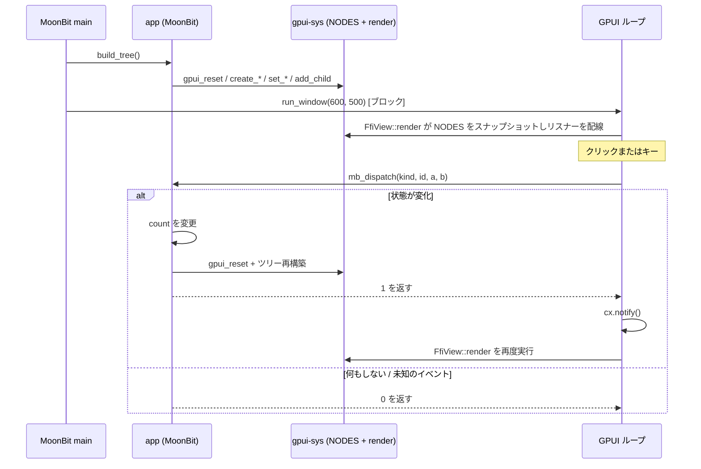

# アーキテクチャ（現状）

本プロジェクトが**現時点で**どのように組み上がっているかを、AI 向けに権威的に記述したドキュメント。これは実験的な、ネイティブ専用の Rust/GPUI ↔ MoonBit 統合であり、安定した汎用 UI API ではない。事実は具体的（ファイルパス、シンボル、シグネチャ）に記す。コードに合わせてこのファイルも更新すること。

関連ドキュメント: [`README.md`](../README.md)（ビルド・実行）、[`moonbit-bindings/README.mbt.md`](../moonbit-bindings/README.mbt.md)、[`moonbit-native-notes.md`](moonbit-native-notes.md)（低レイヤの過去の観測記録）、[`troubleshooting.md`](troubleshooting.md)（過去のバグ）。

## 1. これは何か

**Zed の GPUI**（Rust 製、GPU アクセラレーション UI）を、Rust/C の FFI 層を介して **MoonBit** から呼び出す。現在のデモはインタラクティブな Counter で、ボタン `-1`・`Reset`・`+1`・`+10`、キー `j`・`k`・`r` を備える。UI の記述と Counter のロジックは MoonBit 側に、リテイン方式のツリー保存・レンダリング・GPUI イベントループ・ブリッジは Rust 側にある。

- **`main` は MoonBit が所有する**（`moon run` / バンドルされたバイナリ）。Rust はその実行ファイルにリンクされる静的ライブラリである。
- モデルは **retained + reactive** である。MoonBit がノードツリーを構築して Rust に保存し、GPUI がそれをレンダリングし、イベントは MoonBit へコールバックする。状態を変更するコールバックはツリー全体を再構築して `1` を返す。何もしないコールバックは `0` を返す。Rust は `1` のときだけ GPUI に通知する。

## 2. 構成要素

| ディレクトリ | 言語 | 役割 | 主要ファイル |
|---|---|---|---|
| `gpui-sys/` | Rust | C ABI 越しに GPUI を公開する静的ライブラリ。ノードストア、レンダリング、イベントリスナー | `src/lib.rs`、`build.rs`、`abi.toml`、`cbindgen.toml` |
| `bindgen-moonbit/` | Rust | 生成された C ヘッダーをパースして MoonBit の FFI import 宣言にする CLI | `src/main.rs` |
| `moonbit-bindings/` | MoonBit | 高レベル API、Counter の状態・ロジック、MoonBit 製 `main` | `gpui-bindings.mbt`、生成物 `gpui-bindings-ffi.mbt`、`app/app.mbt`、`cmd/main/main.mbt` |
| ルート | shell / PowerShell | 言語横断のビルド orchestration とプラットフォームセットアップ | `build.sh`、`build.ps1`、`bundle.sh` |

ターゲットは MoonBit の `native`。サポートするホスト/ターゲットの組み合わせは macOS arm64 または x86_64、Linux x86_64（WSLg を含む）、Windows MSVC x64。クロスコンパイルはサポート対象外である。ツールチェーンの最低バージョンはこのリポジトリでは固定していない。ビルドドライバは観測したバージョンを表示し、Cargo.lock が依存解決を固定する（現在は GPUI 0.2.2 を含む）。

## 3. 実行時モデル（retained tree）

- Rust は `gpui-sys/src/lib.rs` に `static NODES: Mutex<Vec<Option<UiNode>>>` を保持する。
  `UiNode` は `Div { size, bg, flex/flex_col, center, gap, rounded, on_click, children }` または `Text { content, color, size }` のいずれかである。
- MoonBit はハンドル経由でノードを構築する。`create_div` と `create_text` がノードをプッシュする。生成が成功すると非負の `i32` ハンドルを返す。負の戻り値はステータス/エラーである。セッター群と `add_child` はハンドル経由で変更を加える。
- `add_child(parent, child)` は子ノードを親の `children` へ移動し、子のスロットは空（absent）になる。
- `FfiView::render` は、mutex を保持したまま存在するノードをクローンして `NODES` をスナップショットし、mutex を解放してから GPUI の要素/リスナーを構築する。これによりロックをリスナーとコールバックの経路から外す。
- 外側の Rust レンダリングコンテナ（MoonBit が生成したルートノードではない）は全サイズの flex column で、`FfiView.focus` を追跡し `on_key_down` を受け取る。クリック可能な各 div には `.id(("gpui_click", click_id))` と `on_click` リスナーが割り当てられる。
- `gpui_reset()` は `NODES` をクリアし、状態変更イベントの後に MoonBit がゼロから再構築できるようにする。何もしないイベントは reset も再構築もスキップする。

## 4. FFI 契約（双方向）

### 4a. MoonBit → Rust（C ABI、UI ビルダー API）

`gpui-sys/include/gpui_sys.h` の C シンボルは、`gpui-sys/src/lib.rs` の Rust 側 `#[unsafe(no_mangle)] pub extern "C"` 関数に対応する。このヘッダーを `bindgen-moonbit` が消費して `gpui-bindings-ffi.mbt` を生成し、`gpui-bindings.mbt` がそれをラップする。

| C シンボル | MoonBit ラッパー（`gpui-bindings.mbt`） |
|---|---|
| `gpui_create_div() -> i32` | `create_div() -> NodeHandle` |
| `gpui_set_size/bg/flex/center/gap/rounded(...)` | `set_size`、`set_bg`、`set_flex_row`/`set_flex_col`、`set_center`、`set_gap`、`set_rounded` |
| `gpui_set_on_click(handle, click_id)` | `set_on_click(handle, click_id)` |
| `gpui_create_text(const uint8_t *ptr, int32_t len, ...) -> i32` | `create_text(String, r, g, b, size)` |
| `gpui_add_child(parent, child)` | `add_child(parent, child)` |
| `gpui_reset()` | `reset()` |
| `gpui_run_window(w, h)` | `run_window(w, h)` — GPUI イベントループ内でブロックする |

テキストの ABI は明示的に借用（borrow）した UTF-8 バイト列である:

```c
int32_t gpui_create_text(const uint8_t *ptr, int32_t len,
                         uint8_t r, uint8_t g, uint8_t b, float size);
```

生成される FFI 宣言は `#borrow(ptr)` 付きで `Bytes` を受け取る。高レベルの `create_text` は MoonBit の `String` を `@utf8.encode` で変換し、`Bytes` と `Bytes.length()` を渡し、NUL ターミネータを付加することはない。Rust はポインタ/長さをその呼び出しの間だけ読み取り、`String::from_utf8_lossy` でデコードする。

| 戻り値 | 意味 |
|---|---|
| `GPUI_STATUS_OK`（`0`） | 操作が正常に完了した |
| `GPUI_STATUS_INVALID_HANDLE`（`-1`） | ノードハンドルが負、範囲外、重複、または割り当て不能 |
| `GPUI_STATUS_WRONG_NODE_KIND`（`-2`） | 要求した操作がそのノード種別には適用できない |
| `GPUI_STATUS_NODE_ABSENT`（`-3`） | ノードは既に `gpui_add_child` で別のノードへ移動済み |
| `GPUI_STATUS_INTERNAL_PANIC`（`-4`） | C 境界を越える前に Rust の panic を捕捉した |

セッター群、`gpui_reset`、`gpui_run_window` はこれらのステータスを返す。現在の高レベル MoonBit ラッパーはこれらの戻り値に `ignore` を呼ぶため、呼び出し元はエラーを観測できない。生成呼び出しは、非負のハンドルか負のステータスのいずれかを返す。

### 4b. Rust → MoonBit（イベントコールバック）

- コールバックは 1つ: MoonBit の `app.dispatch(kind, id, a, b) -> Int`（`moonbit-bindings/app/app.mbt` 内）。
- Rust 側の生成された extern はこれを `mb_dispatch(kind, id, a, b) -> i32` として呼ぶ。`gpui-sys/build.rs` は `gpui-sys/mb_symbol.txt` を読み取り、`#[link_name]` 宣言を出力する。
- ペイロードは 4 つの `i32` 値に固定される。戻り値 `1` は状態が変化しツリーが再構築されたことを意味し、`0` は不変を意味する。Rust は `1` のときだけ `cx.notify()` を呼ぶ。
- イベント種別、修飾ビット、コールバックのパラメータ、コールバックの戻り値型は `gpui-sys/abi.toml` に由来する。ドライバが定数を生成し、シグネチャを検証する。
- `cmd/main/main.mbt` は `app.dispatch` を `_keep` に束縛し、Rust からのみ参照される関数の dead-code elimination（不要コード削除）を防ぐ。

ドライバは固定の `app.dispatch` に対する実際の現在のマングル名を抽出するため、ツールチェーンのマングル方式の変更にも追従する。これはパッケージ/関数名の自動リネームサポートではない。`app` や `dispatch` を変更する場合は、`build.sh` の `PKG_FN_SUFFIX`、`build.ps1` の `$PkgFnSuffix`、および `gpui-sys/build.rs` のコールバック ABI ポリシー/テンプレートを更新する必要がある。MoonBit のマングル名には型が含まれないため、ドライバは `main.c` が利用可能な場合、生成された C から `int32_t` の戻り値と 4 つの `int32_t` パラメータを別途検証する。

## 5. データフロー



`EVENT_CLICK=1` と `EVENT_KEY=2` は `abi.toml` に由来する。クリックリスナーは `(EVENT_CLICK, click_id, 0, 0)` を供給する。外側のフォーカスされたコンテナは 1 文字のキーをその Unicode コードポイントへマップし `(EVENT_KEY, 0, codepoint, mods_bits)` を送る。名前付きキーや複数文字のキーは無視される。意味の決定は MoonBit が行う: `BTN_DECREMENT=1`、`BTN_RESET=2`、`BTN_INCREMENT=3`、`BTN_INCREMENT_10=4`、`j=106`、`k=107`、`r=114`。

## 6. ビルドと実行のパイプライン

ルートのビルドドライバを使用すること。素の `cargo build` にはローカルで生成される `gpui-sys/mb_symbol.txt` が欠ける。素の `moon build` は、MoonBit が変更された外部静的アーカイブを追跡しないため、古い実行ファイルを残すことがある。

`build.sh` は macOS arm64/x86_64 と Linux x86_64 をサポートし、`build.ps1` は Windows MSVC x64 をサポートする。各ドライバは、生成ファイルを変更する前に前提条件/アーキテクチャの事前チェック（preflight）を実行する。選択された `moon.pkg.*` テンプレートは、Cargo のネイティブ静的ライブラリ一覧をそのベースとして受け取る。Linux は XCB/XKB のフラグを、ランタイム専用環境および `.linux-libs` 環境向けにバージョン付き SONAME へ正規化し、必要な `libxcb-xkb` 互換依存を追加する。

両ドライバとも次の順序で処理する:

1. ネイティブのホスト/ターゲットと、必要な MoonBit、Rust、コンパイラ/リンカ、シンボルツールを検証する。ツールチェーンのバージョンを表示し、診断とリンクのためにネイティブの Rust ホストと実際の Cargo ターゲットディレクトリを導出する。
2. `gpui-sys/abi.toml` から MoonBit の ABI 定数を生成する。**現在生成されている** `gpui-sys/include/gpui_sys.h` に対して `bindgen-moonbit` を実行し、生成された MoonBit ファイルをフォーマットする。
3. fatal な `moon check` を実行し、その後 Cargo 由来のネイティブライブラリをまだ持たない状態でコールドな `moon build` を行う。このブートストラップ段階ではネイティブリンクの失敗が想定される。完全な Cargo 一覧を用いる後のビルドが厳密なリンクのゲートである。
4. `app.dispatch` のマングルされたシンボルをちょうど 1 つ抽出する。`main.c` が存在する場所では、生成された C のプロトタイプを `int32_t` の戻り値と 4 つの `int32_t` パラメータとして検証する。`cmd/main/main.mbt` の明示的な `_keep` 型が、全プラットフォームにおける MoonBit コンパイル時のシグネチャアンカーである。
5. 検出されたネイティブの Rust ホスト向けに `gpui-sys` をビルドし、`cargo rustc --lib --crate-type staticlib -- --print native-static-libs` を捕捉し、Cargo metadata が報告するターゲットディレクトリを使って最終的なプラットフォーム用 `moon.pkg` を生成する。`build.rs` は `mb_symbol.txt` を読み取り、コールバックの extern を生成し、Rust の ABI 定数を再生成し、cbindgen で `include/gpui_sys.h` を再生成する。
6. MoonBit のリンク済み出力を削除して再度ビルドし、新しい Rust 静的ライブラリと Cargo 由来のネイティブ依存に対して強制的に再リンクする。
7. リンケージを検証する。macOS/Linux は最終バイナリを調べ、コールバック定義がちょうど 1 つであることを確認する。Windows は、MoonBit の `main.obj` にコールバック定義が 1 つ、`gpui_sys.lib` に未解決参照が 1 つあること、および最終リンクが成功することを検証する（リンク済み PE は通常 COFF シンボルテーブルを省略するため）。

最初の bindgen ステップは、必然的に 1 つ前の Rust ビルド由来のヘッダーを参照する。したがって、Rust の C エクスポートを変更した後は、必要に応じてドライバを再実行/再確認し、新たに再生成されたヘッダーと追跡対象の `gpui-bindings-ffi.mbt` を同期させること。最初の 1 回の bindgen 呼び出しが、同じドライバ実行内で後から再生成されるヘッダーを消費したと仮定してはならない。

`gpui-sys` は `staticlib` である。その未解決の `mb_dispatch` 参照は、最終的な MoonBit 実行ファイルのリンク時にのみ解決される。プラットフォームのテンプレートには、検出された Rust ライブラリディレクトリと Cargo 由来のネイティブリンクフラグ用のプレースホルダが含まれる。Linux は上述の SONAME 互換正規化を適用する。macOS では `bundle.sh` が `dist/Counter.app` を作成し、キーボードの配送にはこのバンドルが必要である。Linux では実行ファイルを直接使う。`.linux-libs` は、利用できないシステムの XCB/XKB ランタイムライブラリ用の、無視されるローカルフォールバックである。WSLg では `env -u WAYLAND_DISPLAY` が確実な明示的 X11 起動方法である。Rust は Wayland 起動時の panic を捕捉し、その変数を除去して 1 度だけ再試行する。Windows は `build.ps1` が用意する MSVC x64 セットアップを使う。

## 7. 不変条件と落とし穴

- **テキスト:** 借用した UTF-8 の `Bytes` と長さを渡す。MoonBit の `String` を C ポインタとして渡したり、NUL 終端の C 文字列契約を用いたりしてはならない。
- **コールバック:** 現在のマングル名は抽出されるが、固定の `app.dispatch(kind, id, a, b) -> i32`、その 4 つの `i32` パラメータ、および `0`/`1` の結果ポリシーはチェックされる。パッケージ/関数名のリネームには、両ドライバの suffix 更新が必要である。
- **再リンク:** `gpui-sys` を変更した後は、ルートのドライバを使うか、`moon build` の前に MoonBit のリンク済み出力を明示的にクリーンすること。
- **ロック:** render は、リスナーが MoonBit コールバックを呼び出し得る前に、`NODES` をスナップショットして解放しなければならない。
- **キーボード:** macOS では `.app` を実行すること。フォーカスは `render` 中ではなく、GPUI ビュー構築時に割り当てられる。
- **ABI 定数:** `gpui-sys/abi.toml` を編集すること。生成物の `abi_constants.rs` や `abi_constants.mbt` を直接編集してはならない。
- **生成された FFI:** `gpui-bindings-ffi.mbt` を手編集しないこと。Rust の C エクスポート変更後は、ヘッダーと突き合わせて検証すること。

## 8. ソースと生成ファイルの所有区分

| 区分 | ファイル |
|---|---|
| 手編集の ABI ソース | `gpui-sys/abi.toml` |
| 手編集の実装 | `gpui-sys/src/lib.rs`、`moonbit-bindings/gpui-bindings.mbt`、`moonbit-bindings/app/app.mbt` |
| 追跡対象の生成ソース | `gpui-sys/include/gpui_sys.h`、`gpui-sys/src/abi_constants.rs`、`moonbit-bindings/abi_constants.mbt`、`moonbit-bindings/gpui-bindings-ffi.mbt` |
| 手編集の OS テンプレート | `moonbit-bindings/cmd/main/moon.pkg.macos`、`.linux`、`.windows` |
| 無視されるビルド生成物 | `moonbit-bindings/cmd/main/moon.pkg`、`gpui-sys/mb_symbol.txt`、`_build/`、`target/`、`dist/` |
| 無視される手動配置フォールバック | `.linux-libs/` |

## 9. 検証の範囲

`gpui-sys/` での `GPUI_SYS_ALLOW_TEST_DISPATCH_STUB=1 cargo test --features test-dispatch-stub` は、リンクされた MoonBit コールバックを必要とせずに、ノードストアのハンドル、ステータス、セッター、attach 時の移動、通知ゲート、および `abi.toml` と生成済み Rust/MoonBit 定数の境界横断一致（drift guard）を固定する。追加の環境変数によるオプトインは、誤った `--all-features` での本番ビルドが実際のコールバックを暗黙に置き換えることを防ぐ。`moonbit-bindings/` からは、`moon check` が MoonBit モジュールを型チェックし、`moon test` が高レベルバインディングとイベントの変化/不変化の遷移を検証する。これらはコールバック抽出や最終的な言語横断リンケージは検証しない。それらの統合チェックはルートのドライバが実行する。Issue #8 は、完全にクリーンな `_build`/`target` ビルドと、MoonBit→C→Rust の完全な境界を通過する非 ASCII/埋め込み NUL テキストに関する、より広範な自動化の作業を依然として保持している。現在のテストは MoonBit の UTF-8 エンコードと Rust のポインタ/長デコードを個別にカバーする。Rust の C エクスポート変更後の生成 FFI の鮮度は、bindgen が Cargo によるヘッダー再生成より前に実行されるため、§6 で述べた再実行/再確認が依然として必要である。有効なルートの CI 設定は存在しない。WSL/Linux は 2026-07-20 にフルビルド、Rust のみの強制再リンク、GUI での `+1` 操作で再確認済み。最新の Windows 確認は 2026-07-19。macOS は再確認していない。

## 10. ファイル → 関心事マップ

- ノードストア、C ABI エクスポート、レンダリング、イベントリスナー: `gpui-sys/src/lib.rs`
- コールバックシンボルの注入、cbindgen によるヘッダー生成、Rust の ABI 定数: `gpui-sys/build.rs`
- ABI のイベント/修飾定数と固定のコールバックポリシー: `gpui-sys/abi.toml`
- C→MoonBit の型マッピングと FFI 生成: `bindgen-moonbit/src/main.rs`
- 生成された低レベルの MoonBit import: `moonbit-bindings/gpui-bindings-ffi.mbt`
- 高レベルの MoonBit UI API と UTF-8 エンコード: `moonbit-bindings/gpui-bindings.mbt`
- Counter の状態、ルーティング、ツリー構築: `moonbit-bindings/app/app.mbt`
- エントリポイントとコールバックの保持: `moonbit-bindings/cmd/main/main.mbt`
- OS ネイティブのリンクテンプレート: `moonbit-bindings/cmd/main/moon.pkg.*`
- ビルド/バンドルの orchestration: `build.sh`、`build.ps1`、`bundle.sh`
